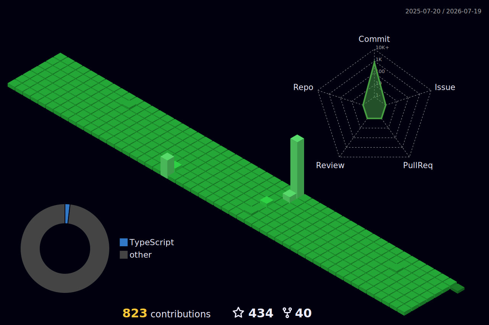

# 👋 Hi, I'm Sila

### Frontend Engineer • Problem Solver • Builder

> **Resilient by nature. Engineer by passion. Building great things with great collaborators. 🚀**

 

---

## 🚀 About Me

I'm a software engineer based in Italy with a passion for building scalable web applications, creating intuitive user experiences, and collaborating with talented people.

Over the years I've learned that great software isn't built by technology alone—it's built by curious minds, strong partnerships, and continuous growth.

✨ Back stronger than ever  
✨ Always learning  
✨ Always building  
✨ Always improving

---

## 💻 Current Focus

- Modern Frontend Architecture
- React & TypeScript
- Redux & Redux Saga
- Node.js & Fastify
- Testing with Cypress & Jest
- Design Systems & UI Engineering
- Performance & Scalability

---

## 🛠 Tech Stack

### Frontend

### Backend

### Testing

### Tools

---

## 📈 GitHub Stats

---

## 🔥 Streak Stats

---

## 🌟 Featured Repositories

| Repository | Description |
|------------|-------------|
| 🚀 Full Stack Engineer | Full-stack learning journey and projects |
| 📚 JavaScript Algorithms | Algorithms and Data Structures |
| 💻 Complete JavaScript Course | JavaScript projects and exercises |
| 🌱 Open Source Contributions | Learning through collaboration |

---

## 📊 Contribution Graph

---

## 🌍 Connect With Me

<a href="https://github.com/somekindofwallflower">GitHub</a> •
<a href="https://stackoverflow.com/users/17074530">Stack Overflow</a> •
<a href="https://codepen.io/somekindofwallflower">CodePen</a> •
<a href="https://twitter.com/wallflower408">Twitter</a> •
<a href="https://instagram.com/programmerscrunity">Instagram</a>

---

## 💭 Philosophy

> **Some chapters test you. Others build you.**
>
> Keep learning. Keep building. Keep moving forward.

---

### ⭐ Thanks for visiting my profile

**Building meaningful software with amazing people.**

