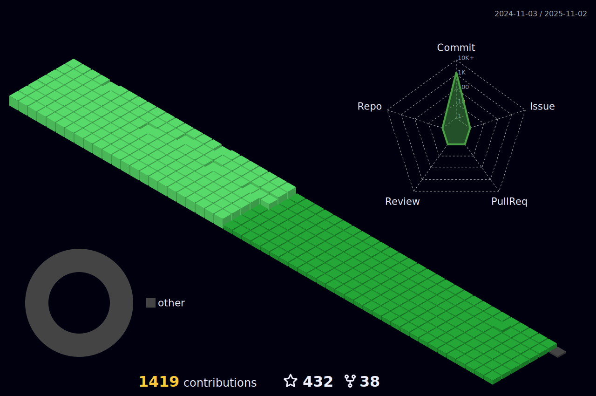

<h1 align="center">Hello Fellow < Developers/ ></h1>
<h3 align="center"> I'm Wallflower, A passionate Web developer from Milano</h3>

<!-- - 🌱 I’m currently mastering my skills in **Javascript**

- 👯 I’m looking to collaborate on **Javascript projects**

- 💬 Ask me about **React, Vue, Angular, NodeJs**	 -->
I love the collaborative and open-source nature of the web development community, and I'm excited to share my projects and contributions on GitHub. My goal is to not only continue learning and growing as a developer, but also to contribute to and learn from the amazing projects and people in the GitHub community.

Feel free to check out my repositories and connect with me on GitHub. I'm always open to new opportunities and collaborations, so don't hesitate to reach out!
  

  

|      Project :octocat:   |     Issues :bug:   | Open PRs :bell:  | Closed PRs :fire:  |
|-------------|-------------------|---|---|
| [**Complete JavaScript Course**](https://github.com/somekindofwallflower/complete-javascript-course-2021) |  |   |   |
| [**JavaScript Algorithms and Data Structures**](https://github.com/somekindofwallflower/javascript-algorithms-and-data-structures) |  |   |   |
| [**Full Stack Engineer**](https://github.com/somekindofwallflower/full-stack-engineer-2021) |  |   |   |

<kbd>***[Click here](https://github.com/somekindofwallflower/my-views-counter)***</kbd> *to view my other projects.*  

<!-- #### [Click here to ask or suggest anything about my repositories!](https://github.com/somekindofwallflower/somekindofwallflower/issues/new)    -->

  

<h3 align="left"> Favorite quote:</h3>
<!-- 
“I always did something I was a little not ready to do. I think that’s how you grow. When there’s that moment of ‘Wow, I’m not really sure I can do this,’ and you push through those moments, that’s when you have a breakthrough.” – Marissa Mayer
 -->

<!-- 2022-02-23 -->

“This is one more piece of advice I have for you: don't get impatient. Even if things are so tangled up you can't do anything, don't get desperate or blow a fuse and start yanking on one particular thread before it's ready to come undone. You have to realize it's going to be a
long process and that you'll work on things slowly, one at a time.”

Haruki Murakami, Norwegian Wood

<h3 align="left">Connect with me:</h3>

<h3 align="left">Languages and Tools:</h3>

                              
		

  
  

<!-- 
 
  

 -->

# Contributions
(in the last 365 days, languages pie based on number of commits)

 
<h3 align="center">
	⬇ Check my pinned projects below and leave a ⭐️ ⬇
</h3>

